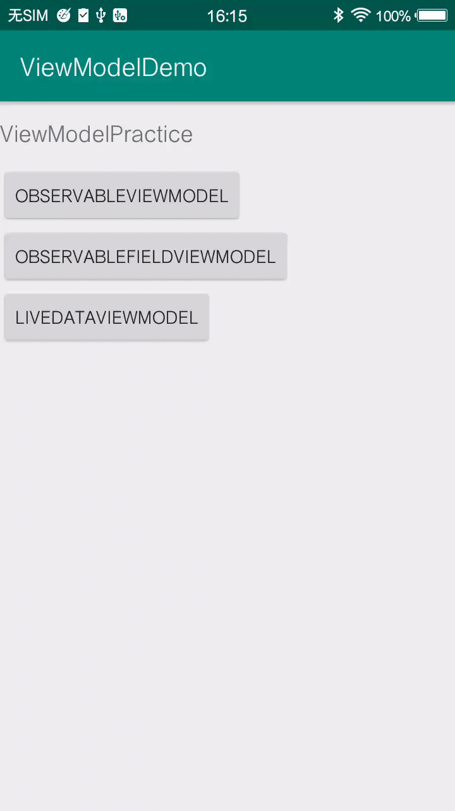

#### 在module的build.gradle的android标签下添加 

```java
    dataBinding{
        enabled=true
    }
```

<p align="center">
	
	<p align="center">
		<em>demo截图</em>
	</p>
</p>

### 后话
ViewModel是2017年I/O大会提出来的，同年也有LifeCycle和LiveData。
ViewModel的目标有：
1. 让状态管理独立于试图控制。（特别是那些比较重的状态，比如从后台获取的一个列表数据）
2. 为状态设置作用域。（这个的好处体现在，如果你是单Activity加多Fragment的模式，可以通过唯一数据源，改一处而动全身。之前的多页面之间状态同步和更新ui比较麻烦，比如使用eventbus，因为状态分发的滥用会造成维护难度直线上升。）
3. 实现了单向依赖。同databingding，你可以选择使用viewmodel还是使用databingding来实现单向依赖。

总之，lifecycel让viewmodel托管数据，同时也解决了重建需要手动的问题。
